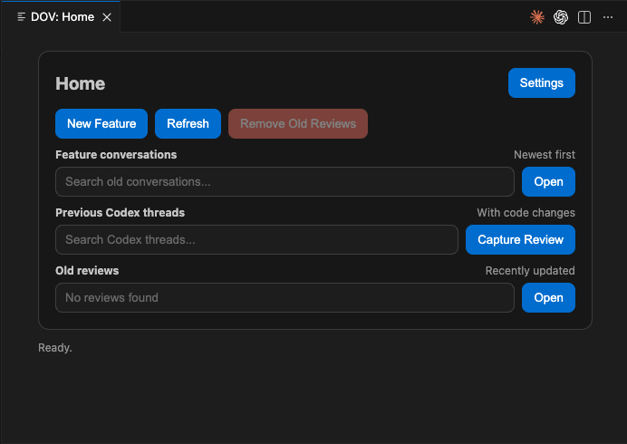
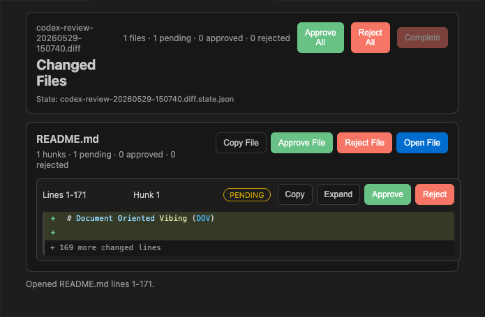

# Document Oriented Vibing (DOV)

A VS Code extension for reviewing AI-written code before it disappears into your project.

DOV turns Codex changes into a focused review surface where you can inspect hunks, jump to the changed file, and approve or reject changes at the chunk level. It also includes `Cmd+C`/`Ctrl+C` double-tap context copying and feature diagrams.




## Why?

AI coding tools can make large edits quickly, but normal diffs are a poor review interface when you are moving fast. DOV makes review the center of the workflow:

1. Ask Codex to make a change in your project.
2. Tell the assistant `+review`.
3. DOV captures the code changes from the current Codex thread.
4. Review each file and hunk in VS Code.
5. Approve, reject, or revisit changes without losing the context of what the AI did.

Additionally if your forgot to add `+review` to your prompt, you can always capture the review from any old conversation in the home screen.



## Review Workflow

Use `+review` after Codex has finished editing code:

```text
+review
```

The assistant opens DOV's VS Code URI handler. The extension then creates a raw diff review in `.reviews/`, opens the review panel, and tracks approve/reject state in a sibling `.state.json` file.

Review features:

- **Thread-aware capture** — captures Codex-written changes from the active thread.
- **Hunk-level review** — approve, reject, or undo individual changed chunks.
- **File-level review** — approve or reject all hunks in a file.
- **Jump-to-file navigation** — select a hunk and open the changed source file in VS Code.
- **Inline status** — pending, approved, and rejected states are visible while reviewing.
- **Persistent state** — review decisions are saved next to the `.diff` artifact.
- **LLM-friendly copy** — copy a file or hunk with enough context to ask an assistant for follow-up changes.

## Quick Start

1. Open any project in VS Code.
2. Run `DOV: Home` from the command palette (`Ctrl/Cmd+Shift+P`).
3. Click the setup/configure button to add the DOV instructions to your `AGENTS.md` and repo-scoped skill.
4. Make code changes with Codex.
5. Ask Codex for `+review`.
6. Review the generated `.reviews/*.diff` in DOV.

## Install

```bash
# Clone and build
git clone https://github.com/ethanitovitch/document-oriented-vibing.git
cd document-oriented-vibing
pnpm install
node esbuild.js

# Package as .vsix
pnpm add -g @vscode/vsce
vsce package --no-dependencies

# Install in your VS Code-compatible editor
code --install-extension document-oriented-vibing-0.0.1.vsix --force
```

## Workflow Modes

Prefix your prompt to the LLM with a mode:

| Mode | What happens |
|------|-------------|
| `+review` | Captures Codex-made changes from the current thread and opens the DOV review panel. |
| `+show` | LLM writes the actual code, then creates a diagram with real file paths. |
| `+plan` | LLM creates a diagram with placeholder file paths. No code written. |

No mode writes files unless the prompt explicitly asks for it.

## Commands

| Command | Description |
|---------|-------------|
| `DOV: Home` | Open the home screen with features, reviews, and Codex threads. |
| `DOV: +review` | Open the latest review diff. |
| `DOV: Capture Codex Review` | Capture files written by a Codex thread into a review diff. |
| `DOV: Copy Selection for LLM` | Copy the current selection, or current line, with `path:line` context. Shortcut: double-tap `Cmd+C` on macOS or `Ctrl+C` elsewhere. |
| `DOV: Quick New Feature` | Create a new feature diagram file. |
| `DOV: Open Feature` | Open a specific feature diagram. |

## Agent Review Command

Agents should open DOV's URI handler for `+review`:

```bash
code --open-url "vscode://<installed-extension-id>/captureReview?name=auth-review.diff&threadId=$CODEX_THREAD_ID"
```

This opens a VS Code URI and requires GUI access. If running in a sandbox, agents should request outside-sandbox/escalated execution up front. Agents should not treat exit code 0 alone as proof that the extension opened, especially if Electron/macOS stderr includes messages such as `task_name_for_pid`. After running the URI command, agents should verify `.reviews/<name>.diff` exists before saying the review opened.

The editor routes the URI to the extension. The extension creates `.reviews/` if needed, writes `.reviews/auth-review.diff`, and opens the review panel.

## Feature Diagrams

DOV can also plan and visualize features as diagrams. This is useful before writing code, but it is secondary to the review workflow.

```text
+plan user authentication with JWT and rate limiting
```

The LLM creates `.features/user-auth.md` and DOV opens the diagram:


Feature diagram capabilities:

- **Live preview** — diagrams update as files change.
- **Clickable nodes** — file paths in node labels open that file in VS Code.
- **Line numbers** — append `:42` to a path to jump to a specific line.
- **Hover tooltips** — `## Details` adds per-node descriptions.
- **Scroll to zoom** — Ctrl/Cmd + scroll to zoom in or out.
- **Any Mermaid diagram** — flowchart, sequence, class, state, ER, journey, gantt.

## How It Works Under the Hood

```text
.reviews/
├── auth-review.diff
└── auth-review.diff.state.json

.features/
├── user-login.md
└── order-pipeline.md

.agents/
└── skills/
    └── document-oriented-vibing/
        ├── SKILL.md
        ├── agents/openai.yaml
        └── references/
            ├── schema.md
            └── review-schema.md
```

The extension watches `.reviews/*.diff` and `.reviews/*.json` and opens a review page for the latest review artifact. Diff review approvals are saved to a sibling `.state.json` file.

It also watches `.features/*.md` for changes and renders them as interactive diagrams in a webview panel. From `DOV: Home`, DOV checks your `CLAUDE.md`, Codex `AGENTS.md` pointer, and repo-scoped DOV skill for versioned markers. The setup button adds or updates any missing pieces.

## Contributing

```bash
pnpm install
node esbuild.js

# Press F5 in VS Code to launch the Extension Development Host
```

## License

MIT
