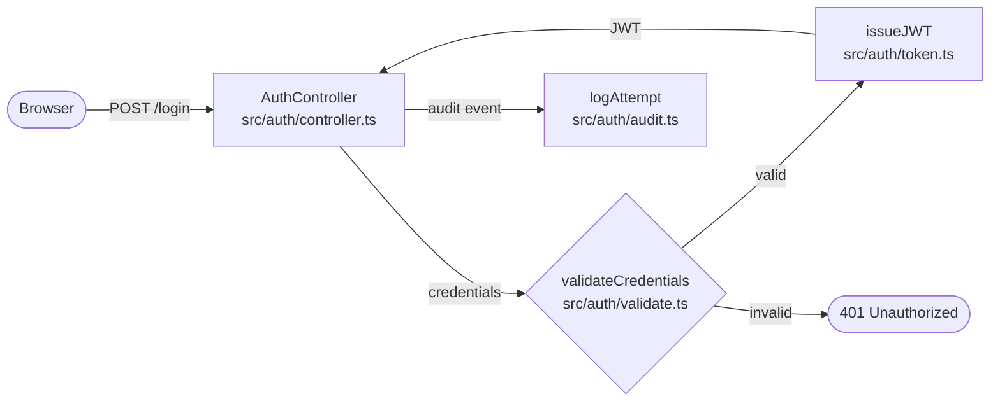

# Document Oriented Vibing (DOV)

A VS Code extension that lets you plan features as Mermaid diagrams before writing code. Tell your AI assistant what to build, see the architecture as a live diagram, iterate on it, then generate the code.

Stop vibing blindly. See what you're building first.


## Why?

When you vibe-code with an LLM, you have no idea what it's actually building. DOV fixes that:

1. Tell your LLM `+plan auth system` — it creates a Mermaid diagram of the planned architecture. No code yet.
2. Review the diagram — see every component, file path, and data flow. Iterate until you're happy.
3. Tell your LLM `+show auth system` — it builds the feature, then shows you the diagram with real file paths.
4. Click any node to jump to the code. Hover for details.
5. Tell your LLM `+review` — it captures the current git diff and opens it in DOV.

## Install

```bash
# Clone and build
git clone https://github.com/ethanitovitch/document-oriented-vibing.git
cd document-oriented-vibing
pnpm install
node esbuild.js

# Package as .vsix
pnpm add -g @vscode/vsce
vsce package --no-dependencies

# Install in your VS Code-compatible editor
code --install-extension document-oriented-vibing-0.0.1.vsix --force
```

## Quick Start

1. Open any project in VS Code
2. Run `DOV: Home` from the command palette (`Ctrl/Cmd+Shift+P`)
3. Create a new feature — this creates a `.features/` folder with a `.md` file
4. Edit the markdown file with a Mermaid diagram, or let your LLM do it

The extension automatically injects instructions into your project's `CLAUDE.md`, adds a small Codex `AGENTS.md` pointer, and installs a repo-scoped DOV skill under `.agents/skills/`.

## Workflow Modes

Prefix your prompt to the LLM with a mode:

| Mode | What happens |
|------|-------------|
| `+plan` | LLM creates the diagram with placeholder file paths. No code written. Review and iterate first. |
| `+show` | LLM writes the actual code, then creates the diagram with real file paths. |
| `+review` | LLM opens the DOV capture URI; the extension writes and opens the review diff. |

No mode writes files unless the prompt explicitly asks for it.

### Example

```
+plan user authentication with JWT and rate limiting
```

The LLM creates `.features/user-auth.md` and opens the diagram:



## Feature File Format

Features live as `.md` files in `.features/` at your project root:

```markdown
# Feature: user login

## Diagram

` ` `mermaid
flowchart LR
    Client([Browser]) -->|POST /login| Auth["AuthController\nsrc/auth/controller.ts:15"]
    Auth --> Validate{"validateCredentials\nsrc/auth/validate.ts:8"}
` ` `

## Summary
Authenticate with email/password, return a JWT.

## Details
- **AuthController**: Express route handler, validates request body.
- **validateCredentials**: bcrypt comparison against users table.
```

## Features

- **Live preview** — diagram updates as the file changes (by you, LLM, or git)
- **Clickable nodes** — file paths in node labels open that file in VS Code
- **Line numbers** — append `:42` to a path to jump to a specific line
- **Hover tooltips** — `## Details` section adds per-node descriptions on hover
- **Scroll to zoom** — Ctrl/Cmd + scroll to zoom in/out on the diagram
- **Any Mermaid diagram** — flowchart, sequence, class, state, ER, journey, gantt
- **Review workflow** — `+review` quickly captures and opens raw git diff output
- **LLM context copy** — double-tap `Cmd+C` to copy selected code with its file path and line range for pasting into an LLM
- **LLM-native** — auto-injects Claude instructions and a repo-scoped Codex skill so your LLM knows the format
- **Auto-open** — new feature diagrams and review files open when the LLM creates them

## Commands

| Command | Description |
|---------|-------------|
| `DOV: Home` | Open the home screen with all features |
| `DOV: Quick New Feature` | Create a new feature file |
| `DOV: Open Feature` | Open a specific feature diagram |
| `DOV: +review` | Open the latest review diff |
| `DOV: Capture Codex Review` | Capture files written by the previous Codex turn into a review diff |
| `DOV: Copy Selection for LLM` | Copy the current selection, or current line, with `path:line` context. Shortcut: double-tap `Cmd+C` on macOS or `Ctrl+C` elsewhere |

## Agent Review Command

Agents should open DOV's URI handler for `+review`:

```bash
code --open-url "vscode://<installed-extension-id>/captureReview?name=auth-review.diff&threadId=$CODEX_THREAD_ID"
```

This opens a VS Code URI and requires GUI access. If running in a sandbox, agents should request outside-sandbox/escalated execution up front. Agents should not treat exit code 0 alone as proof that the extension opened, especially if Electron/macOS stderr includes messages such as `task_name_for_pid`. After running the URI command, agents should verify `.reviews/<name>.diff` exists before saying the review opened.

The editor routes the URI to the extension. The extension creates `.reviews/` if needed, writes `.reviews/auth-review.diff`, and opens the review panel.

## How It Works Under the Hood

```
.features/
├── schema.md          # Auto-generated format reference
├── user-login.md      # Your feature diagrams
└── order-pipeline.md

.reviews/
└── auth-review.diff   # Raw git diff output from +review

.agents/
└── skills/
    └── document-oriented-vibing/
        ├── SKILL.md
        ├── agents/openai.yaml
        └── references/
            ├── schema.md
            └── review-schema.md
```

The extension watches `.features/*.md` for changes and renders them as interactive diagrams in a webview panel. It also watches `.reviews/*.diff` and `.reviews/*.json` and opens a review page for the latest review artifact. Diff review approvals are saved to a sibling `.state.json` file.

From `DOV: Home`, DOV checks your `CLAUDE.md`, Codex `AGENTS.md` pointer, and repo-scoped DOV skill for its versioned markers. The setup button adds or updates any missing pieces.

## Contributing

```bash
pnpm install
node esbuild.js

# Press F5 in VS Code to launch the Extension Development Host
```

## License

MIT
